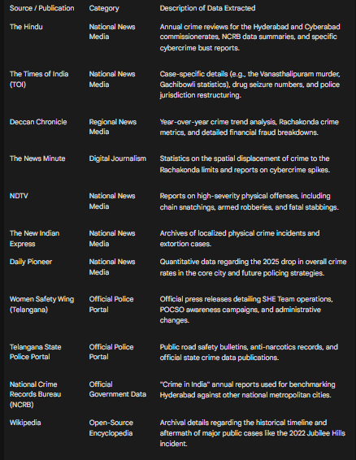

# 🛡️ SafeRoute Hyderabad — Civic AI Safety Intelligence Platform

**Smart Safety-Aware Navigation System for Hyderabad City**

SafeRoute suggests the **safest route** — not just the shortest — by analyzing real crime data, lighting conditions, police station proximity, and AI-powered risk assessment.


### 🌐 [**Live Demo →** https://manjitgolconda.github.io/safe-route-hyderabad/](https://manjitgolconda.github.io/safe-route-hyderabad/)

> **No paid APIs. No backend required. All AI runs in-browser. Fully static-site deployable.**

---

## ✨ Features

### Core Navigation
| Feature | Description |
|---------|-------------|
| 🗺️ Interactive Map | Dark-themed Leaflet map centered on Hyderabad (CARTO Dark Matter) |
| ⚡ Dual Routing | Shortest route + Safest route via OSRM (up to 5 alternatives) |
| 📊 Route Comparison | Side-by-side distance, time, safety scores, and AI risk assessment |
| 📍 Geolocation | Use current GPS location as start point |
| 📱 Fully Responsive | Sidebar, panels, and chat adapt to mobile viewports |

### Safety Data Layers
| Layer | Description |
|-------|-------------|
| 🔴 Crime Heatmap | 300 geocoded crime zones with severity-weighted intensity |
| 🌑 Poorly-Lit Areas | 20 low-lighting zones (IT corridors, ORR stretches, construction zones) |
| 🛡️ Police Stations | 35 real stations with commissionerate assignments and case volumes |
| 🟣 Specialized Units | SHE Teams, Cybercrime Wing, TGANB, Traffic Wing markers |
| 🟠 Hotspot Zones | Top 10 hotspot station areas with radius overlays |

### Crime Analytics Dashboard
| Panel | Description |
|-------|-------------|
| 📈 Crime Trends | 5-year bar chart (2021–2026) with annotated insights |
| 🏢 Commissionerates | Comparison cards — Hyderabad City, Cyberabad, Rachakonda |
| 🔥 Top Hotspots | Ranked list (#1 Gachibowli through #10) with case volume bars |
| 💻 Cybercrime Impact | ₹296.32 Cr financial loss, 4,042 cases, fraud typology breakdown |
| ⚠️ Notable Incidents | Scrollable timeline of 8 real high-severity incidents (click → map flyTo) |
| 👮 Law Enforcement | Enforcement stats, SHE Teams, drunk driving cases |

### 🤖 AI-Powered Features (Client-Side)
| Feature | Description |
|---------|-------------|
| 🧮 Dynamic Risk Scoring | Multi-factor formula: crime severity, time-of-day, lighting, hotspot proximity, incident recency |
| 📉 AI Trend Forecast | Linear regression on 5-year crime data → predicts next year's cases with confidence % |
| 🔍 Anomaly Detection | Flags crime categories with unusual spikes (z-score > 1.5σ above mean) |
| 🛡️ Personalized Safety Mode | 4 toggles: Women Safety, Avoid Dark Areas, Avoid Property Crime, Avoid Cyber Hotspots |
| 💬 Civic AI Assistant | Rule-based chatbot answering area safety, crime stats, and trend queries |

### Community Features
| Feature | Description |
|---------|-------------|
| ⚠️ Report Unsafe Area | User-submitted safety reports stored in localStorage |
| 🌙 Dark Theme | Professional enterprise-grade glassmorphism UI with micro-animations |

---

## 🧠 Safety Score Algorithm

The safety score (0–100) is computed by sampling **100 points** along each route:

| Factor | Weight | Details |
|--------|--------|---------|
| **Crime Zone Proximity** | High | Severity² exponential weighting — murder (100) vs cybercrime (16). Inner radius 350m (full penalty), outer decay to 800m |
| **Poorly-Lit Areas** | Medium | Darkness level (1 - lightingLevel) × proximity. Amplified at night |
| **Police Station Bonus** | High | Strong positive bonus within 600m, moderate to 1.5km |
| **User Reports** | Medium | Community-reported unsafe zones penalize routes within 400m |

The route with the **highest safety score** is labeled "Safest Route" (green). If the shortest route is already the safest, the app clearly indicates this.

### AI Risk Score (Experimental)

A separate AI risk assessment runs on each computed route:

```
riskScore = (crimeWeight × 0.40) + (timeWeight × 0.20) + (lightingWeight × 0.15) 
          + (hotspotWeight × 0.15) + (incidentWeight × 0.10)
```

**Time-aware logic:**
- **Night (8PM–5AM)** → violent crime weight boosted 25%, lighting impact amplified 1.5×
- **Daytime** → lighting impact reduced 50%

**Risk Levels:** Low (0–25) · Moderate (26–50) · High (51–75) · Critical (76–100)

---

## 📊 Data Sources

| Dataset | Source | Records |
|---------|--------|---------|
| Crime zones | NCRB & Hyderabad Police reports + geocoded estimates | 300 points |
| Police stations | Real station names, commissionerates, case volumes | 35 stations + 3 HQs |
| Poorly-lit areas | Known dark zones (IT corridors, ORR, construction zones) | 20 zones |
| Crime statistics | NCRB Annual Report, City Police Annual Report 2025 | 15+ crime types |
| Crime trends | Year-over-year IPC case totals (2021–2026) | 6 years |
| High-severity incidents | Anonymized real incidents from police reports | 8 incidents |
| Law enforcement | Commissionerate structure, specialized units | 4 commissionerates |
| Severity weights | Criminological severity-based scoring | 30+ crime types |





> **Note:** Aggregate statistics and organizational data are from real sources. GPS coordinates for individual crime zones are plausible estimates, not exact crime scene locations.

---

## 🛠️ Tech Stack

- **Frontend**: HTML5, CSS3, JavaScript (ES6+) — no frameworks
- **Map**: [Leaflet.js](https://leafletjs.com/) + [CARTO Dark Matter](https://carto.com/basemaps/)
- **Heatmap**: [Leaflet.heat](https://github.com/Leaflet/Leaflet.heat)
- **Routing**: [OSRM Public API](https://router.project-osrm.org/) (free, no API key)
- **AI**: Client-side JavaScript (linear regression, statistical analysis, keyword intent matching)
- **Icons**: [Lucide Icons](https://lucide.dev/) (SVG)
- **Fonts**: Google Fonts (Inter + JetBrains Mono)
- **Storage**: Browser `localStorage` for user reports and safety preferences

---

## 📁 Project Structure

```
safe-route-hyderabad/
├── index.html                  # Main HTML — sidebar, panels, chat UI, map container
├── style.css                   # Dark theme — 1900+ lines of professional CSS
├── script.js                   # Core app logic — routing, scoring, rendering, UI
├── ai-engine.js                # AI module — risk scoring, forecast, anomaly, chat
├── README.md                   # This file
└── data/
    ├── crime-zones.json        # 300 geocoded crime points with severity weights
    ├── poorly-lit-areas.json   # 20 poorly-lit zones with lighting levels
    ├── police-stations.json    # 35 police stations + 3 commissionerate HQs
    ├── crime-data.json         # Detailed crime statistics, cybercrime, women safety
    ├── severity-engine.json    # 30+ crime type weights and risk band definitions
    ├── crime-trends.json       # 2021–2026 longitudinal crime data
    ├── high-severity-incidents.json  # 8 notable anonymized incidents
    └── law-enforcement.json    # Commissionerate structure, specialized units
```

---

## 🚀 Setup & Run

### Option 1 — Python HTTP Server (Quickest)

```bash
cd safe-route-hyderabad
python -m http.server 8080
```

Open `http://localhost:8080`

### Option 2 — Node.js Serve

```bash
npx -y serve .
```

### Option 3 — VS Code Live Server

1. Install the **Live Server** extension
2. Right-click `index.html` → **Open with Live Server**

> ⚠️ Opening `index.html` directly via `file://` will **not work** — `fetch()` requires an HTTP server.

---

## ☁️ Deployment

### GitHub Pages (Currently Live ✅)

This project is deployed and live at:

🔗 **https://manjitgolconda.github.io/safe-route-hyderabad/**

To deploy your own:
1. Fork this repo
2. Go to **Settings → Pages → Source: main branch**
3. Your site will be live at `https://<username>.github.io/safe-route-hyderabad/`

### Vercel

```bash
npx -y vercel --prod
```

### Netlify

Drag and drop the project folder at [app.netlify.com/drop](https://app.netlify.com/drop)

---

## 🏗️ Architecture

```
┌─────────────────────────────────────────────────┐
│                  index.html                      │
│  ┌──────────┐  ┌──────────┐  ┌───────────────┐ │
│  │ Sidebar  │  │   Map    │  │  AI Chat      │ │
│  │ Panels   │  │ (Leaflet)│  │  (floating)   │ │
│  └────┬─────┘  └────┬─────┘  └───────┬───────┘ │
│       │              │                │         │
│  ┌────▼──────────────▼────────────────▼───────┐ │
│  │              script.js                      │ │
│  │  • Data loading   • Route computation       │ │
│  │  • Safety scoring • UI rendering            │ │
│  │  • Layer management • Event handling        │ │
│  └────────────────────┬───────────────────────┘ │
│                       │                         │
│  ┌────────────────────▼───────────────────────┐ │
│  │            ai-engine.js (AI namespace)       │ │
│  │  • Risk scoring    • Trend forecast         │ │
│  │  • Anomaly detect  • Safety modes           │ │
│  │  • Chat assistant  • Time-aware logic       │ │
│  └────────────────────────────────────────────┘ │
│                       │                         │
│  ┌────────────────────▼───────────────────────┐ │
│  │              data/*.json                    │ │
│  │  8 JSON files — crime, police, trends, etc  │ │
│  └────────────────────────────────────────────┘ │
└─────────────────────────────────────────────────┘
```

---

## 🤖 AI Features — Technical Details

### 1. Dynamic Risk Scoring (`AI.computeRiskScore`)
- Samples crime data within 800m radius, severity-weighted
- Time-of-day detection: morning / afternoon / evening / night
- Night mode: violent crime (severity ≥ 8) boosted 25%, lighting concern amplified 1.5×
- Hotspot proximity check against top 10 ranked stations
- Incident recency: 2-year decay weighting

### 2. Trend Forecast (`AI.forecastTrends`)
- Least-squares linear regression on complete-year crime totals
- Computes R² coefficient of determination for confidence
- Filters partial years (YTD data excluded from regression)

### 3. Anomaly Detection (`AI.detectAnomalies`)
- Computes mean and standard deviation of percentage changes across crime categories
- Flags categories where `change > mean + 1.5 × σ`
- Reports z-score for each flagged anomaly

### 4. Personalized Safety Modes (`AI.personalizedWeights`)
- **Women Safety**: Boosts rape, sexual assault, POCSO, kidnapping to maximum weight (10)
- **Avoid Dark Areas**: Increases lighting penalty, robbery, and chain snatching weights
- **Avoid Property Crime**: Increases theft, auto theft, house breaking weights
- **Avoid Cyber Hotspots**: Increases cybercrime and digital arrest weights

### 5. Civic AI Assistant (`AI.chat`)
- 9 intent patterns with regex matching
- Handles: area safety (day/night), cybercrime stats, women safety, top hotspots, trend forecasts, overall stats, police info
- Known area database: 23 Hyderabad localities
- All responses generated from local JSON data — no external API calls

---

## 🔮 Future Roadmap

- [ ] Real-time crime data via open government APIs
- [ ] Firebase Auth for user accounts + cloud-stored reports
- [ ] Walking / transit routing modes
- [ ] Community reviews — rate and verify area safety
- [ ] Street-level imagery integration
- [ ] Push notifications for alerts in saved areas
- [ ] Offline mode with cached map tiles
- [ ] TensorFlow.js integration for advanced crime prediction models

---

## 👨‍💻 Author

**Manjit Golconda** — [@manjitgolconda](https://github.com/manjitgolconda)

---

## 📄 License

MIT — Free for personal and commercial use.
